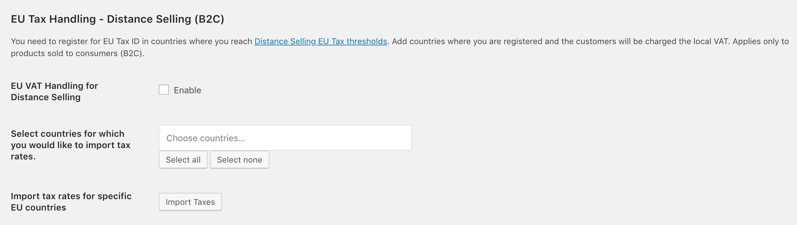

# Better Tax Handling Plugin

The plugin adds three sections to the default Tax menu in WooCommerce: 

- **Tax Handling for B2B**
- **EU Tax Handling - Digital Goods (B2C)**
- **EU Tax Handling - Distance Selling (B2C)**

### Tax Handling for B2B

This part of the plugin handles taxes for B2B (Business to Business). Let's have a look at the options for B2B tax handling offered by the plugin and how it affects tax calculation for the end user.

- **B2B Sales** - When enabled (for either EU Store or Non-EU Store), this option adds an option in the checkout form for making the purchase as a Business Entity. When the visitor clicks the B2B option in the checkout form, an additional Tax ID field opens for entering the Business Tax ID.

- **Tax ID field required for B2B** - Enabling this option makes it mandatory for all B2B transactions to provide a Business Tax ID.

- **B2B sales in the home country** - Whether B2B transactions getting done in the home country gets taxed or not is decided via this option.

- **B2B sales in the EU when VIES/VAT ID is provided** - If you would like to revoke taxes for B2B sales in the European Union if the Business Tax ID is provided, then this option should be enabled.

- **B2B sales outside the country** - For B2B sales apart from the home country, we can enable/disable taxes with the help of this option.

### Digital Goods (B2C - EU)

This part of the plugin handles taxes for [Digital Goods](https://quaderno.io/resources/eu-vat-guide/) for Consumers when selling to the EU. Currently, the plugin offers 2 options for this class of taxes.

- **EU Tax Handling for Digital Goods** - If your store has Digital Goods which you are planning to sell, then you must enable this option if you would like to collect taxes for the same as well. If you enable this option, then it is also advised to use the next option which allows you to import tax rates for Digital Goods applicable for the EU countries.

- **Import tax rates for all EU countries and create tax class Digital Goods** - Clicking this option imports tax rates for all EU countries (for Digital Goods) and creates a tax class **"Digital Goods"**. You must apply this tax class to all the digital goods in your store for the right taxes to calculated at the checkout. 

### Distance Selling (B2C - EU)

This part of the plugin handles taxes for Digital Selling for Consumers. As a store owner, you will need to register for EU Tax ID in countries where you reach [Distance Selling EU Tax thresholds](https://www.vatlive.com/eu-vat-rules/distance-selling/distance-selling-eu-vat-thresholds/).

Currently, the plugin offers 2 options for this class of taxes.

- **EU VAT Handling for Distance Selling** - Enabling this option will allow you to collect taxes on transactions done via countries which fall under the "Distance Selling" category. You will be responsible for specifying the countries for this category in the next option. Only the countries added will be applicable for tax calculation at the time of checkout. Also, this option has no impact on the B2B transactions.

- **Select countries for which you would like to import tax rates** - Add countries to this multi-select option box whose tax rates you would like to import.

- **Import tax rates for specific EU countries** - Clicking this option imports tax rates for all EU countries added to the above option. Any country added outside of EU will be ignored by this option and only taxes for countries which fall within EU will be imported.
