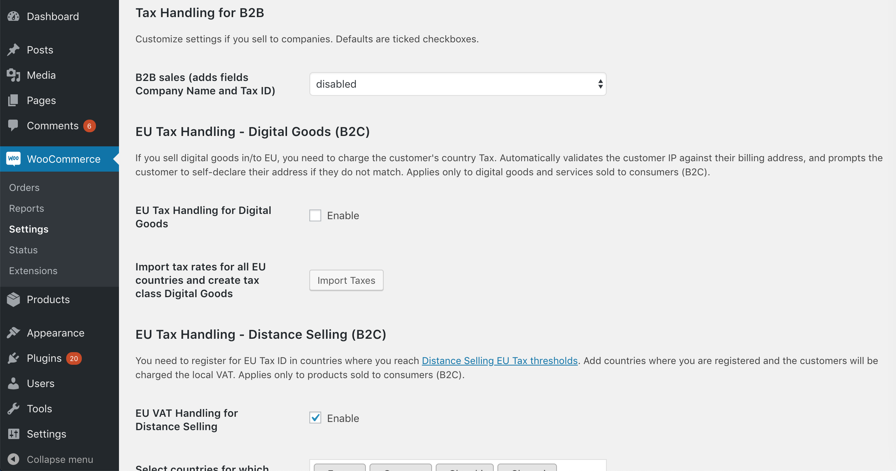

# Better Tax Handling Plugin

## Introduction

**Better Tax Handling** is a plugin for WooCommerce stores that simplifies the complex part of taxation for B2B and B2C selling. It is developed by [**WooCart**](https://woocart.com).

The plugin covers the following tax scenarios:

- [Tax Handling for B2B](/docs/b2b-tax-handling.md)
- [Digital Goods (B2C)](/docs/b2c-digital-goods.md)
- [Distance Selling(B2C)](/docs/b2c-distance-selling.md)