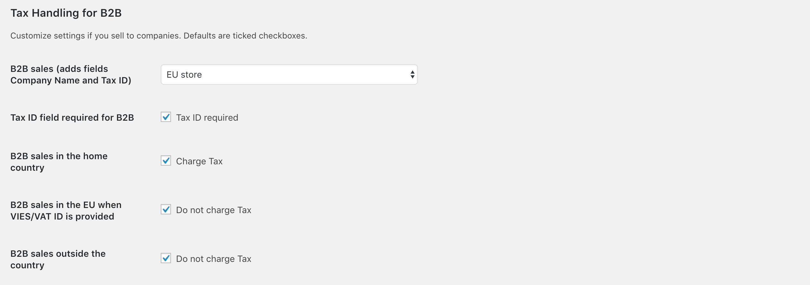
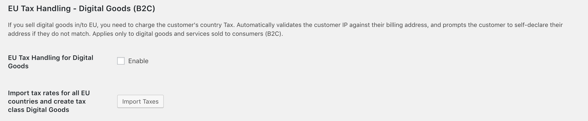

# EU VAT & B2B Taxes for WooCommerce

The plugin adds three sections to the default Tax menu in WooCommerce:

- EU VAT Handling for B2B
- EU VAT Handling for Digital Goods (B2C)

Make sure you have your country's standard, reduced and zero rates entered in WooCommerce settings. This is not handled by the plugin. We also recommend using Shop base address for tax calculation.

The default settings should be the correct setting for all EU countries. That said, make sure to confirm the settings with your accountant or tax advisor.

Please keep in mind you or your accountant need to do the VAT reporting to the EU, as this is not done by the plugin.

## Plugin Settings

### EU VAT Handling for B2B

This section handles taxes for B2B (Business to Business). Let's have a look at the options for B2B tax handling offered by the plugin and how it affects tax calculation for the customer.

- **B2B Sales** - Enable this option (for either EU Store or Non-EU Store) to add a checkbox for businesses to the checkout form. When the visitor clicks the option in the checkout form, an additional VAT ID field opens for entering the Business VAT ID. 

- **Tax ID field required for B2B** - Enabling this option makes it mandatory for all B2B customers to provide a Business VAT ID. By default, it is required.

- **B2B sales in the home country** - Whether B2B sales in the home country are taxed or not. By default, it is charged.

- **B2B sales in the EU when VIES/VAT ID is provided** - Whether B2B sales in EU are taxed or not. By default, it is not charged. This option is disabled if you chose the Non-EU Store in the first dropdown.

- **B2B sales outside the country** - Whether B2B sales outside the home country and EU are taxed or not. For example: selling from Germany to the USA. By default, it is not charged.

### EU VAT Handling for Digital Goods (B2C - EU)

This part of the plugin handles taxes for [Digital Goods](https://quaderno.io/resources/eu-vat-guide/) for consumers when selling to the EU. This option has no impact on the B2B transactions.

For this to work properly, you need to go through two steps.

- **EU Tax Handling for Digital Goods** - Click to enable Digital Goods tax. Use the next option to import tax rates and create tax class.

- **Import tax rates for all EU countries and create tax class Digital Goods** - Click to import standard VAT rates for all EU countries and create a tax class Digital Goods. You must assign this tax class to all digital goods in your store. Digital goods are charged the customer's country tax rate.

## Reports

There are two reports added to the Reports page.

- **Reports > Orders > B2B Transactions** - Lists all B2B transactions.
- **Reports > Orders > Tax Collected By Country** - Lists the total tax collected by country for easier reporting to an accountant and/or tax authorities.
