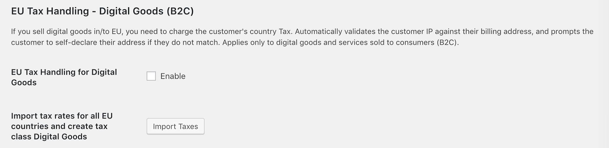

## Digital Goods (B2C)

This part of the plugin handles taxes for Digital Goods for Consumers. Currently, the plugin offers 2 options for this class of taxes.

- **EU Tax Handling for Digital Goods** - If your store has Digital Goods which you are planning to sell, then you must enable this option if you would like to collect taxes for the same as well. If you enable this option, then it is also advised to use the next option which allows to import tax rates for Digital Goods applicable for the EU countries.

- **Import tax rates for all EU countries and create tax class Digital Goods** - Clicking this option imports tax rates for all EU countries (for Digital Goods) and creates a tax class **"Digital Goods"**. You must apple this tax class to all the digital goods in your store for the right taxes to calculated at the checkout. 
